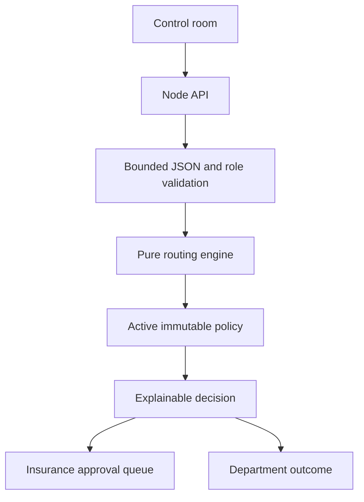

# Parcel Routing Control Room

A small, dependency-free parcel routing application built for the technical assessment. It provides a browser workflow for single parcels and JSON/XML batches, with a separately tested routing engine.

## Run it

Requires Node.js 20 or newer.

```bash
npm test
npm start
```

Open http://localhost:4173. The supplied `Container_68465468.xml` is a useful parser fixture, although its legacy records do not include destination countries; those records are intentionally reported as validation errors rather than routed with guessed data.

## Architecture decisions

- `src/routing.js` is a pure policy engine. It has no browser or file-system dependency, which makes its decisions easy to test and reuse from an API worker later.
- Rules are represented by an immutable, versioned policy object. The active version is included in every result. A production deployment would load an approved policy snapshot at startup, validate it, and reject changes that are not reviewed.
- High-value parcels are a distinct `pending` state. They are not routed and cannot accidentally bypass insurance approval.

- The browser accepts JSON and XML. XML was chosen alongside JSON because the supplied business input is XML and it preserves the existing container shape; JSON remains convenient for modern integrations.
- The local server has no runtime dependencies, serves only known paths under its root, and applies a restrictive CSP plus common browser security headers.

## Routing contract

| Condition | Result |
| --- | --- |
| Value greater than EUR 1,000 | Pending: Insurance Approval |
| Weight up to and including 1 kg | Mail Department |
| Weight above 1 kg up to and including 10 kg | Regular Department |
| Weight above 10 kg | Heavy Department |
| Missing or invalid required data | Error; never guess |

## Extending rules safely

1. Add a new field to the parcel contract and validate it at the boundary.
2. Add or update the policy value with a new policy version. Keep the old policy available for replaying historical decisions.
3. Make the new rule explicit in `routeParcel`. Order matters: blocking conditions such as insurance must run before a department is selected.
4. Add tests for the normal case, both boundaries, rule precedence, invalid input, and the unchanged legacy behavior.
5. Review the policy and deploy it behind a feature flag or canary. Monitor the decision distribution before making it the default.

## Quality and delivery

`npm test` runs 14 regression tests covering boundaries, approval precedence, validation, policy overrides, batch identity, policy lifecycle, simulation, replay, and invariants. A practical feature path is:

```text
feature/fragile-parcel-rule -> pull request -> tests + review -> merge to main -> canary policy version
```

Beyond automated tests, correctness should be checked with a reviewed decision table, replayed production samples, property-based tests for monotonic weight thresholds, manual UI checks, and a business-owner sign-off on the policy snapshot.

## Reliability and observability

The UI reports per-row errors and gives a bounded summary for large batches; it renders at most 500 rows while retaining full counts. In a production service, each decision should emit a structured event containing a correlation ID, policy version, input validation outcome, decision, and latency, while excluding recipient PII. Metrics should include invalid-input rate, pending approval rate, department distribution, upload failures, and processing latency. Alerts should cover sustained errors, unusual distribution shifts, and queue age. Failed batches should be retained with a retryable status and an idempotency key rather than partially committed silently.

## Security

Implemented here: strict input validation, a 5 MB browser upload limit, text-only DOM rendering for imported values, no dynamic code execution, path traversal protection in the static server, CSP, `nosniff`, and a restrictive referrer policy.

Before public deployment I would add authentication and role-based authorization, HTTPS/HSTS, server-side streaming size limits, schema validation, malware scanning for uploads, rate limiting, audit logging, dependency and container scanning, secret management, encrypted storage, privacy retention rules, and centralized alerting. Upload parsing should happen in an isolated worker if files are untrusted at scale.

## AI-assisted development

Two prompts used during development were:

1. “Design a dependency-free parcel routing engine with explicit boundary tests and a distinct approval state for high-value parcels.”
2. “Review this browser batch-upload design for input validation, XSS, path traversal, large-file handling, and observability gaps.”

I changed the generated direction by keeping the policy engine pure, making the policy version visible in outcomes, rejecting missing country data instead of inferring it, bounding display rendering, and adding the security headers and tests above. AI is useful for surfacing cases and draft structure, but it cannot know the company’s approval semantics, data classification, operational thresholds, or whether a legacy input should be repaired. Those decisions require human review and business acceptance.

## Operator experience

The control room supports manual decisions, drag-and-drop batch upload, a built-in sample batch for demos, status filters for large result sets, bounded rendering, and CSV export of the complete decision evidence. The interface is intentionally generic: it speaks in parcels, policies, departments, and decisions rather than tying the workflow to one carrier or warehouse.

The overview now adds a compact operations sidebar, live KPI cards, an attention-required queue, recent activity, and a policy impact simulator. The simulator compares the active policy with candidate thresholds against the current batch and never activates or mutates policy state.

## Interview walkthrough

1. Run the app and route `0.9 kg`, `3 kg`, `10 kg`, and `11 kg` parcels.
2. Route a `EUR 1,001` parcel and show that it is held for Insurance Approval.
3. Load the sample batch, filter to “Needs approval”, and export the full decision evidence as CSV.
4. Upload a JSON or XML batch by choosing a file or dropping it into the intake area; discuss the summary versus bounded table rendering.
5. Open `src/routing.js`, change a policy value through a new version, add its boundary tests, and run `npm test` before merging.
6. Explain that every result carries the policy version, which makes a decision replayable after a business-rule change.

## Production-oriented extensions

The browser submits batches to the server API. If the API is unavailable, the UI clearly labels the result as an offline preview rather than implying persistence.



Implemented API surfaces include `POST /api/parcels/route`, `POST /api/batches`, `GET /api/dashboard`, `GET /api/policies`, `POST /api/policies`, policy validate/approve/activate/rollback actions, `GET /api/approvals`, approval actions, `POST /api/simulate`, `POST /api/replay`, `POST /api/retry`, `GET /api/audit`, `GET /health`, and `GET /ready`.

Every decision now carries `parcelId`, `status`, `decision`, `validation`, `matchedRule`, `reason`, evaluated conditions, timestamp, and policy version. Result rows are keyboard accessible and open an evidence inspector in the UI.

Policies follow `DRAFT -> VALIDATED -> APPROVED -> ACTIVE`. Active policy records are immutable; a new version is required for changes. Simulation and replay use the selected policy without mutating the active policy. Batch submissions require an idempotency key, return the original record for duplicates, and share a correlation ID with audit events and structured error logs.

High-value parcels create `PENDING_APPROVAL` records. Reviewer or admin roles can approve or reject once; approval routes the parcel through the original policy version. Operators can process, upload, and retry; reviewers can validate and decide approvals; admins can manage policies and view audit records. This is deliberately a server-side assessment abstraction, not an identity provider.

## Trade-offs and remaining limitations

The operations store is in-memory so the assessment stays dependency-free and easy to inspect. A production deployment would use durable storage, a queue, distributed idempotency records, authenticated identity-provider claims, a dead-letter store, structured log shipping, and isolated XML parsing. Retry metadata and audit records are modeled in the service layer, but persistence and a long-lived retry worker are intentionally outside this small demo.

## Modular low-level design

The implementation follows a dependency-injected application composition root:

```text
server.js
  -> http/apiRouter.js
      -> operations.js (application facade)
          -> batches/batchService.js
          -> approvals/approvalService.js
          -> analysis/decisionComparison.js
          -> reporting/dashboardService.js
          -> policy.js
          -> audit/auditLog.js
          -> routing.js (pure domain engine)
```

- **Single Responsibility:** batch processing, approvals, audit, comparison, reporting, authorization, and HTTP transport each have separate modules.
- **Open/Closed:** new comparison/reporting implementations can be injected without changing the routing engine.
- **Liskov/Substitution:** services depend on small behavioral collaborators (`policyStore`, `auditLog`, `approvalService`) rather than concrete HTTP or storage details.
- **Interface Segregation:** the browser/API receives the small `createOperations()` façade; internal services expose only the methods they own.
- **Dependency Inversion:** orchestration receives `clock`, policy, audit, approval, and batch collaborators, making deterministic tests possible.

The in-memory maps are repository implementations for this assessment. They can be replaced by durable repositories at the composition root without changing `routing.js`, approval rules, policy transitions, or API contracts.

## Authentication and authorization

The API now has an explicit authentication boundary. Local assessment runs use demo mode by default, where the existing `X-Role` and `X-Actor` headers are accepted only to keep the browser demo convenient. This mode must never be used for a public deployment.

Production mode requires bearer authentication:

```bash
AUTH_MODE=production \
AUTH_TOKENS='token-from-identity-provider:alice:ADMIN,another-token:bob:REVIEWER' \
npm start
```

The server derives the actor and role from the configured token mapping and ignores client-supplied role headers. Invalid or missing credentials return `401 Unauthorized` with `WWW-Authenticate: Bearer`. The token mapping is a dependency-free assessment seam; production should replace it with Entra ID/OIDC JWT validation, key rotation, token expiry, and identity-provider claims.

Roles remain server-authorized: operators can process and retry, reviewers can validate policies and decide approvals, and admins can manage policies and view audit logs. Authentication identifies the caller; authorization decides whether that identity may perform the action.
# 🧩 Technical Assessment: Parcel Routing System

## Overview

You are a developer at a parcel delivery company responsible for modernizing an internal parcel routing system.

The system processes parcels and routes them to different departments based on business rules.

The company expects the system to:

- Be adaptable to business changes
- Be reliable when failures occur
- Be safe to evolve
- Provide sufficient visibility when something goes wrong
- Demonstrate thoughtful engineering beyond basic coding

You are encouraged to use AI tools during development. However, you must demonstrate ownership of the design and clearly explain your reasoning.

---

## 📦 Core Requirements

### 1. Parcel Routing

Each parcel contains:

- Weight (kg)
- Value (€)
- Destination country
- Optional additional attributes

#### Default Routing Rules

- Up to 1 kg → **Mail Department**
- Up to 10 kg → **Regular Department**
- Over 10 kg → **Heavy Department**
- Parcels with value greater than €1,000 require **Insurance approval** before routing

#### Expectations

- Implement routing logic.
- Make business rules adaptable to change.
- Design the system so that future departments or routing conditions can be added without major refactoring.
- Consider how rule changes could impact system correctness and safety.

> You are not given strict instructions on how to handle configuration safety — your design should account for business risks.

---

### 2. User Interface

Provide a simple interface that allows:

- Entering parcel data
- Uploading batch data (JSON or XML — your choice, justify it)
- Viewing routing outcomes clearly

The interface should:

- Be usable by non-technical operators
- Communicate decisions clearly
- Handle large input files gracefully
- Be responsive (if web-based)

Focus on clarity and usability over visual complexity.

---

### 3. Quality Assurance

- Include automated tests for routing logic.
- Demonstrate how your tests protect against regressions.
- Show how you would introduce a new rule safely.
- Include a small example of feature development from branch to merge.

Also describe how you validate correctness beyond automated tests.

---

### 4. Monitoring & Reliability

Design the system so that if something goes wrong, the team is notified and there is enough information available to investigate, resolve the issue, and detect unusual patterns in parcel routing.

---

### 5. Security

This application will be deployed facing the public internet. Implement appropriate measures to safeguard it.

Consider how you would protect the system against common threats.

#### Requirements

- Implement security measures in your application.
- Be prepared to explain:
  - What additional measures you would implement to secure the system.
  - Why those measures are important.

---

### 6. Debugging

You will be provided with a buggy routing function during the interview.

Be prepared to:

- Identify the issue quickly
- Explain how you reasoned about it
- Fix it cleanly
- Prevent similar issues in the future

---

### 7. AI Usage

You are expected to use AI tools for at least two parts of this assignment.

You must:

- Show the prompts you used
- Explain what you modified and why
- Demonstrate that you understand the generated code
- Reflect on limitations of AI in this context

---

## 📂 Deliverables

- Production-ready application
- You can choose any programming language
- Tests
- Configuration system (if used)
- README including:
  - Architecture decisions
  - Trade-offs
  - AI usage documentation
  - How to extend the system with new routing rules
- Short presentation (10–15 minutes)

---

## 🎤 Interview Expectations

During the interview, you should be able to:

- Demo your system end-to-end
- Modify or extend routing logic live
- Explain design trade-offs
- Explain how your system adapts to business change
- Discuss how failures would be handled
- Walk through your AI-assisted development process

---

## 🧠 What We Are Evaluating

- Engineering judgment
- Adaptability
- System thinking
- Code quality
- UX awareness
- Testing discipline
- Ability to reason about failure
- Responsible use of AI tools

---

This assessment is intentionally open-ended. There is no single correct implementation.
