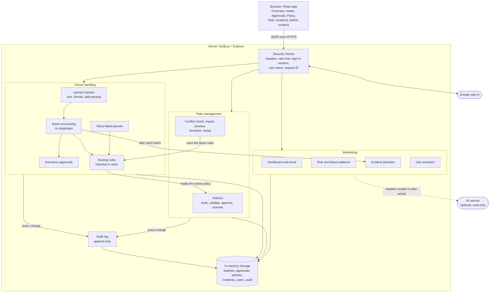
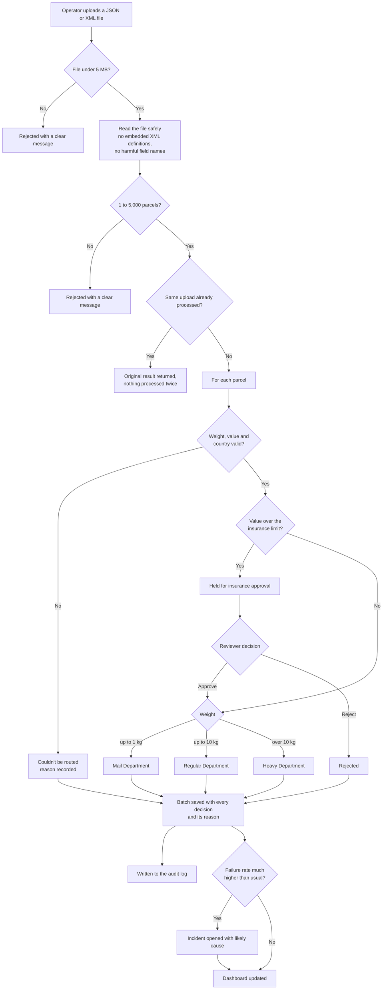
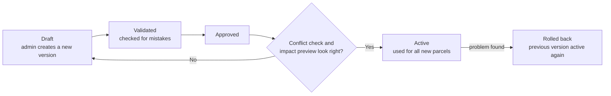

# ParcelFlow – Parcel Routing System

ParcelFlow routes parcels to the right department based on weight and value. It is built for the people who use it every day: operators who enter and upload parcels, reviewers who approve high-value parcels, and admins who change the routing rules.

Routing a parcel is the easy part. Most of the work in this project went into what surrounds it:

- every decision explains why it was made
- rule changes can be previewed and rolled back
- the team can see when something is going wrong
- every important action is recorded

---

## Contents

1. [Getting started](#getting-started)
2. [Architecture](#architecture)
3. [How routing works](#how-routing-works)
4. [Adding a new routing rule](#adding-a-new-routing-rule)
5. [Changing rules safely](#changing-rules-safely)
6. [The user interface](#the-user-interface)
7. [Testing](#testing)
8. [Monitoring and reliability](#monitoring-and-reliability)
9. [Security](#security)
10. [Debugging approach](#debugging-approach)
11. [Architecture decisions and trade-offs](#architecture-decisions-and-trade-offs)
12. [AI usage](#ai-usage)
13. [Known limitations](#known-limitations)

---

## Getting started

**You need:** Node.js 20 or newer.

```bash
npm install                        # installs the server and the client
cp server/.env.example server/.env # create your local settings
npm run dev                        # starts the server (port 4000) and the client (port 5173)
```

Open http://localhost:5173.

Without Google sign-in configured, the app signs you in as a local admin so you can try everything straight away.

**Project layout**

```
server/   Node.js + Express API: routing, policies, approvals, security
client/   React app (Vite + Tailwind): the screens operators use
docs/     Threat model and architecture decision notes
```

**Optional settings** (in `server/.env`)

| Setting | What it does |
|---|---|
| `GOOGLE_CLIENT_ID`, `GOOGLE_CLIENT_SECRET` | Turns on real "Sign in with Google". Local sign-in is switched off automatically once these are set. |
| `ADMIN_EMAILS`, `REVIEWER_EMAILS` | Gives these people a higher role the first time they sign in. Everyone else starts as an operator. |
| `GEMINI_API_KEY` | Turns on AI wording for the assistant and risk summary. The app works fully without it. |
| `MAX_UPLOAD_BYTES`, `MAX_BATCH_SIZE` | Upload limits (defaults: 5 MB and 5,000 parcels). |

## Architecture

### How the pieces fit together

The browser app only talks to the server through `/api`. Every request passes through the same security checks before it reaches the part of the server that handles it. The routing rules always read the currently active policy, and every change is written to the audit log.



### What happens to a parcel

This is the path from upload to a final decision. A single parcel entered by hand follows the same path from "Validate" onwards.



### How a rule change goes live



---

## How routing works

Each parcel has a weight, a declared value and a destination country, plus optional extra details such as the recipient's address.

The default rules are:

| Condition | Result |
|---|---|
| Missing or invalid weight, value or country | Rejected with a clear reason |
| Value over €1,000 | Held for insurance approval |
| Up to 1 kg | Mail Department |
| Up to 10 kg | Regular Department |
| Over 10 kg | Heavy Department |

The rules run in this order, and the first one that applies decides the outcome.

Validation always runs first, so bad data is never routed by guesswork. The insurance check runs before the weight rules, so an expensive parcel is always held for a person to look at. Once a reviewer approves it, it is routed by weight as usual.

The limits (1 kg, 10 kg, €1,000) and the department names are not written into the code. They come from the **active policy**, which an admin can change from the Policy Manager screen.

Every decision records:

- the rule that matched
- the reason, in plain words ("Parcel value EUR 1500 exceeds EUR 1000 insurance threshold.")
- the numbers that were compared
- the policy version that was active at the time

This means anyone can later see exactly why a parcel went where it did, even after the rules have changed.

---

## Adding a new routing rule

Each rule is a small class in `server/src/routing/rules/`. The routing engine simply runs them in order. Adding a rule does not require changing the engine or any existing rule.

**Example:** send parcels for the Netherlands to a new "Express NL" department.

1. Create the rule:

```js
// server/src/routing/rules/ExpressCountryRule.js
import { RoutingRule } from '../RoutingRule.js';
import { RoutingDecision } from '../../domain/RoutingDecision.js';

export class ExpressCountryRule extends RoutingRule {
  evaluate(parcel, policy) {
    if (parcel.destinationCountry !== 'NL') return null; // not my case, let the next rule decide
    return RoutingDecision.routed({
      policy, parcel,
      department: 'Express NL',
      matchedRule: 'EXPRESS_NL',
      reason: 'Parcel is going to the Netherlands.'
    });
  }
}
```

2. Register it where the engine is set up (`server/src/container.js`), choosing where it sits in the order:

```js
routingEngine.addRule(new ExpressCountryRule(), { before: 'MailWeightRule' });
```

3. Add a test in `server/tests/unit/routing.test.js` for the new case and for the cases it must **not** affect.

4. Run `npm test`. The existing routing tests confirm nothing else changed.

To change a limit rather than add a rule (for example, raise the insurance threshold), no code is needed at all. Create a new policy version in the Policy Manager.

---

## Changing rules safely

A wrong rule change can send thousands of parcels to the wrong place, so rule changes follow a fixed process.

**1. Versions, not edits.** A live policy can never be edited. Every change is saved as a new draft version.

**2. Step-by-step approval.** A draft moves through these stages, and none can be skipped:

```
Draft → Validated → Approved → Active
```

An invalid policy can never become active. Only admins can manage policies.

**3. Conflict check.** Before activating, the system warns about rules that don't make sense, for example:
- a mail limit that is not lower than the regular limit
- an insurance threshold of zero, which would send every parcel to approval

**4. Impact preview.** The system re-runs the new policy against **every parcel already processed** and shows how many decisions would change, and which parcels would newly need approval.

**5. Rollback.** If something still goes wrong, one click brings back the previous version.

**6. Replay.** Any past batch can be re-run under any policy version to compare results. This uses the same routing code as live traffic, so the preview can't differ from what would really happen.

Every step is recorded in the audit log with who did it and when.

---

## The user interface

The app is built for non-technical operators:

- plain language, with technical details hidden in expandable sections
- clear status labels
- people's names instead of email addresses

### Main screens

| Screen | What it's for |
|---|---|
| Dispatch Overview | Counts per department, a chart of parcels over time, and what needs attention right now |
| Intake | Enter one parcel, upload a file, or generate a sample batch |
| Approvals | Reviewers approve or reject high-value parcels |
| Policy Manager | Create, check, activate and roll back routing rules |
| Impact Simulator / Decision Replay | Preview rule changes on sample or past parcels |
| Risk, Incidents, Digital Twin | Spot problems and test "what if volume doubles?" |
| Ops Assistant | Ask questions like "Why are approvals growing?" |
| Audit Log, Security Center, Access Control | Admin tools |

### Why JSON and XML

I support both formats.

- **JSON** is simple to create and read, and it is what most modern systems export.
- **XML** is supported because real depot files often come in XML. The app reads the "container" format used for shipments, where each parcel has a recipient address. That format has no country field, so the country is set to NL only when the postcode is clearly Dutch (for example `4744AT`). Anything else is rejected instead of guessed.

### Handling large files

- Files can be dropped onto the upload area or chosen normally.
- The server checks the file size (5 MB) and parcel count (5,000) before doing any real work.
- While a file is processed, an animation shows the current step ("Reading the file", "Checking and routing parcels"). It doesn't show a fake progress percentage.
- Results tables show the first 100 rows so the page stays fast.
- The same file can't be processed twice by accident.

### Other details

- Works on desktop and mobile. On small screens the sidebar becomes a drawer.
- Light and dark themes, following the device setting until the user picks one.
- Keyboard shortcut Cmd/Ctrl + K to jump to any screen.
- Animations are reduced for users who ask for less motion.

---

## Testing

Run the tests with:

```bash
npm test             # 96 server tests
npm run test:client  # 13 client tests
```

### What the tests cover

- **Routing logic:** every rule, the edges of each limit (exactly 1 kg, exactly 10 kg, exactly €1,000), invalid input, and rule order
- **Policies:** each lifecycle step, the rule that live policies can't be edited, conflict checks and rollback
- **Approvals and retries:** approving, rejecting, deciding twice, and retrying failed parcels
- **HTTP tests:** the real server is started and called like a browser would, covering sign-in, permissions, uploads and per-user data
- **Security:** oversized files, broken XML, harmful XML, and users trying actions their role doesn't allow

### Protecting against regressions

Six tests guard rules that must never break:

- an invalid parcel is never routed normally
- a live policy is never changed silently
- a retry never processes a parcel twice
- a simulation never changes real data
- an operator can never activate a policy
- every change is written to the audit log

If a future change breaks any of these, the test run fails before the change can be merged.

### From branch to merge: a small example

This is the process I follow for a change such as the Express NL rule above:

```bash
git checkout -b feature/express-nl-rule
# 1. write the tests first: NL parcels go to Express NL, other countries are unchanged
# 2. add the rule class and register it
npm test && npm run test:client     # everything must pass
git add server/src/routing/rules/ExpressCountryRule.js server/src/container.js server/tests/unit/routing.test.js
git commit -m "Add Express NL routing rule"
git push -u origin feature/express-nl-rule
# 3. open a pull request, describe the change and its impact, and get it reviewed
# 4. merge once the review is approved and the tests pass
```

For a threshold change instead of a code change, the "review" step happens inside the app: draft, conflict check, impact preview, approve, activate.

### Checking correctness beyond automated tests

- **Using the app in a real browser.** After each change I click through the affected screens, in both themes and on a phone-sized screen. This found real bugs the tests had missed, such as requests being sent with the wrong method.
- **Real data.** I uploaded an actual shipment file and checked every result by hand.
- **Impact preview and replay.** These let a person check a rule change against real parcels before it goes live.
- **Live security check.** The Security Center fires eight real attack attempts at the running app and shows whether each was blocked.

---

## Monitoring and reliability

The goal: when something goes wrong, the team notices, and has enough information to find and fix it.

### Being notified

- **Needs attention now.** The Overview lists open incidents, a growing approval backlog, and batches that partly failed.
- **Incidents.** When the failure rate of a batch jumps well above normal, an incident opens on its own. Related failures are grouped into one incident instead of one alert per parcel. Tiny test batches can't trigger one.
- **Risk panel.** This flags trends such as validation failures rising over recent batches. When there isn't enough data, it says so instead of guessing.

### Investigating

- **Likely cause.** Each incident shows a likely cause, found by grouping failures by type (for example "missing weight"), plus suggested next steps.
- **Request IDs.** Every request gets its own ID. It appears in the server logs, the audit log and any error message a user sees, so one report can be traced end to end.
- **Structured logs.** Server logs are written as JSON lines, ready to send to a log tool.
- **Audit log.** It records who did what, when, and what changed. Entries can't be edited or deleted.
- **Time Machine.** The System Health screen shows what the system looked like at any earlier moment: the active policy, failure rate, queue size and open incidents.

### Staying reliable

- The same upload can't be processed twice, even if it's sent twice at the same time.
- Retrying failed parcels is limited to three attempts. Each parcel is marked as fixed, needing a human, or given up on, so bad data isn't retried forever.
- The server limits how many requests it handles at once, and how many each user can send per minute.
- If the AI service is down or out of quota, the app switches to its built-in answers and tells the user why.

**For production, I would add:**
- sending logs and incidents to an alerting tool (such as a Slack channel or an on-call pager)
- an uptime check on the `/api/health` endpoint

---

## Security

The app is designed to face the public internet.

### Already in place

| Threat | Protection |
|---|---|
| Harmful or oversized uploads | Size limit checked before reading the file; XML with embedded definitions is refused; the XML reader cannot load external files; suspicious field names (`__proto__`) are rejected |
| Someone doing things their role doesn't allow | Three roles (operator, reviewer, admin), checked on the server for every action, never in the browser |
| Seeing other people's data | Operators only see their own parcels; guessing another batch's ID returns "not found" |
| Password guessing and flooding | Rate limits (300 requests per minute, 20 sign-in attempts per 15 minutes) and a cap on requests handled at once |
| Session theft | Secure, HTTP-only session cookies that expire after 8 hours |
| Accidental backdoor | Local test sign-in is refused once Google sign-in is set up |
| Leaking internal details | Users see a simple error plus a request ID; full details stay in the server logs |
| Secret keys | Stored only on the server, never sent to the browser |
| Script injection | Strict browser security headers (Content Security Policy) |

More detail is in [docs/THREAT_MODEL.md](docs/THREAT_MODEL.md).

### What I would add next, and why

- **HTTPS everywhere with a web application firewall.** Encrypts traffic and blocks common attacks before they reach the app.
- **A secrets manager instead of an `.env` file.** Keys can be rotated and access is logged.
- **A shared store (Redis) for sessions and rate limits.** Protection keeps working when more than one server runs.
- **CSRF tokens.** An extra layer on top of the current cookie settings for form submissions.
- **Automatic dependency scanning** (e.g. Dependabot). Known security issues in libraries are caught early.
- **A real database with backups and access controls.** Data survives restarts and can be restored.
- **Regular penetration testing.** Someone outside the team tries to break in.

---

## Debugging approach

When I get a buggy routing function, I:

1. **Reproduce it.** I write a failing test with a clear example, such as "a 1 kg parcel should go to Mail".
2. **Check the edges first.** Most routing bugs are at boundaries: `<` instead of `<=`, rules in the wrong order, or text read as numbers ("10" vs 10).
3. **Fix the root cause.** I fix it in one place, not with a special case.
4. **Keep the test.** The failing test stays in the suite so the bug can't come back.
5. **Prevent the whole class of bug.** For example, validate input types up front and add tests for every limit.

This project follows the same habits. The boundary tests in `server/tests/unit/routing.test.js` exist for exactly this reason.

---

## Architecture decisions and trade-offs

| Decision | Why | Trade-off |
|---|---|---|
| Routing as a list of small rules run in order | New rules can be added without touching existing ones | Rule order matters and must be tested |
| Versioned policies that can't be edited once live | Every past decision can still be explained; rollback is easy | Every small change needs a new version |
| Rule limits stored in the policy, not in code | Business users can change limits without a release | New kinds of conditions still need a new rule in code |
| In-memory by default, MongoDB optional | Simple to run and review with no setup; add `MONGODB_URI` for real persistence with no code changes | Without it, data is lost when the server restarts |
| Google sign-in, with a local sign-in only for development | Real security in production; easy to try locally | Needs a Google project to be set up for real use |
| Risk detection uses simple, visible rules, not machine learning | Easy to understand and check; honest about limited data | Less clever than a trained model |
| AI is optional and can only explain, never act | The app never depends on AI and can't make unsafe changes | AI answers are limited to what the built-in tools can look up |
| The same routing code runs for simulations and live traffic | Previews always match reality | None worth noting |

Longer notes on each decision are in [docs/decisions/](docs/decisions/).

---

## AI usage

I used an AI assistant at several points in this project, mainly as a research tool. I stayed in charge of the work throughout: I decided what to build and how, made the design decisions, and reviewed, changed and tested everything before keeping it.

### How I used it

- **Research before deciding.** I compared approaches for:
  - making routing rules changeable without code changes
  - reading uploaded XML safely
  - stopping the same file from being processed twice
  - grouping many failures into one incident
- **Investigating problems.** When something behaved unexpectedly, I used it to help trace the cause, then chose the fix myself.
- **Drafting.** It produced first versions of some code, tests and documentation. I reviewed each one, rewrote parts that didn't fit the design, and tested the result in the app.

Product decisions were never left to the AI: what each role may do, how rule changes are approved, and how uncertain data is handled.

### Example prompts and what I decided

**1. Data visible to new users**
> "Why is data showing 243 parcels even for a new user who hasn't uploaded anything? Fix this."

- **Finding:** all users were reading from one shared data store.
- **My decision:** I compared three options (per-user, per-role, shared) and chose per-role. Operators see only their own data. Reviewers and admins see everything, because reviewers must approve other people's parcels.
- **How I checked it:** I signed in as a brand-new operator and confirmed the dashboard started empty.

**2. A real shipment file failing to upload**
> "Uploading gives the error 'parcels not between 1 and 5000'."

- **Finding:** the file used a container format the reader didn't recognise, and that format has no country field.
- **My decision:** set the country to NL only when the postcode is clearly Dutch, and reject anything else rather than guess.

**3. The AI feature not working**
> "Why is my AI thing not working? I gave you the API key."

- **Finding:** the key was fine, but the free quota (20 requests) was used up because the risk panel called the AI on every page load.
- **My decision:** reuse answers when nothing has changed, pause after a quota error, and show the user a clear message when AI is unavailable.

**4. Making the UI usable for non-technical operators**
> A longer brief asking for a compact layout, business language, names instead of emails, and honest loading states.

- **My decision:** I reviewed every screen, rejected designs that looked generic, and kept refining until text and buttons were readable in both themes.

### Where I overruled AI suggestions

- **Retries.** An early suggestion retried bad data blindly, which would always fail the same way. I redesigned it so each failure is marked as fixed, needing a human, or given up on.
- **Rule builder.** I rejected a "generic rule builder" that would have pretended to support conditions the system doesn't have. The conflict checker only covers the real rule model.
- **Bugs caught by hand.** Clicking through the app found two bugs the tests missed: requests sent with the wrong method, and a sign-in library shared between test runs. I fixed both at the source.

### Understanding the code

I can walk through any part of the system live:

- how a parcel moves through the rules
- how a policy becomes active
- how incidents are detected
- how the AI is limited to read-only lookups

### Limitations of AI here

- AI can't decide business matters such as who may approve high-value parcels, how long data must be kept, or how much risk is acceptable. Those need people.
- AI suggestions can look right and still be wrong. Nothing was kept without being run, tested and checked in the browser.
- Inside the app, the AI can never:
  - approve a parcel
  - change a rule
  - change a user's role
  - edit the audit log

  It can only read data and explain it. If it fails, the app falls back to its built-in answers.
- The free AI tier is very limited, so the app must work well without it, and it does.

---

## Known limitations

- **No database by default.** Data is lost on restart unless `MONGODB_URI` is set (see [ADR-010](docs/decisions/ADR-010-mongodb-persistence.md)). With it, everything survives a restart, but two server processes sharing one database still keep separate copies in memory and don't see each other's writes live -- fine for one server, a real constraint before running more than one.
- **Single server.** Sessions and rate limits live in one server's memory. Running several servers needs a shared store such as Redis.
- **Short memory for risk detection.** Risk and incident detection only use data since the last restart.
- **Simple capacity forecast.** The Digital Twin uses a straight-line estimate, not a detailed model.
- **Browser tests are manual.** The next step would be automated browser tests (Playwright) in CI.
